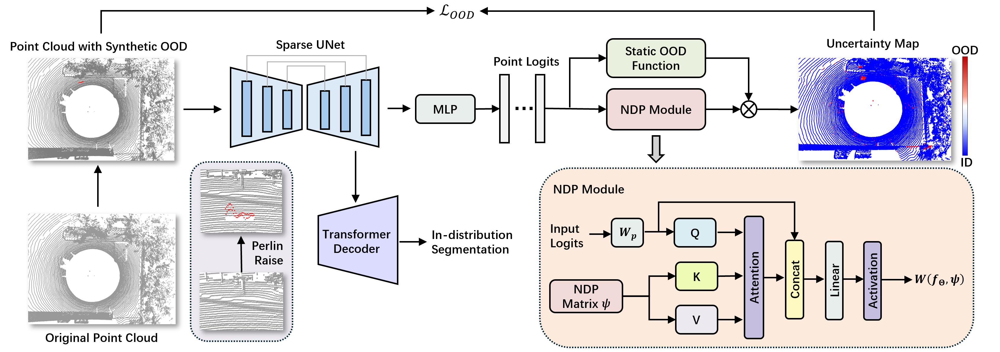

# Neural Distribution Prior for LiDAR Out-of-Distribution Detection




This code adapts the Mask4Former codebase for 3D anomaly segmentation. For more details, please check the original Mask4Former codebase here: [Mask4Former](https://github.com/YilmazKadir/Mask4Former).

---

## Code Dependencies and Installation
The main project dependencies are:
```yaml
cuda: 12.1
cudnn: 9.0.0+
python: 3.10
```
In general, you should be able to install the project with any CUDA 12 and Python 3.8+ versions.
I recommend using Python 3.10 and CUDA 12.1, or a slightly newer version, mainly because I don't want to deal with Python 3.11 and NumPy version 2.
I have tested the code with CUDA 12.1 and 12.5 for Python 3.10 and 3.11. In principle, it should work with CUDA 11.6+ and Python 3.7, as in the original Mask4Former codebase.

```bash
uv venv -p 3.10
source .venv/bin/activate
```

```bash
uv pip install torch==2.3.0+cu121 torchvision==0.18.0+cu121 --extra-index-url https://download.pytorch.org/whl/cu121
uv pip install volumentations PyYAML==6.0.2 numpy==1.24.4 setuptools==59.8.0 opencv-python natsort tensorboard wheel GitPython fire ninja "hydra-core<=1.0.5" python-dotenv pandas fire joblib GitPython flake8 "pytorch-lightning==1.9.5" loguru

# might be necessery to build minkowskiengine
uv pip install git+https://github.com/kumuji/FilePacker.git
uv pip install git+https://github.com/facebookresearch/pytorch3d.git@v0.7.6 --no-deps --no-build-isolation
```

To install MinkowskiEngine with CUDA 12+, MinkowskiEngine needs a few modifications.
For more details, check this comment: https://github.com/NVIDIA/MinkowskiEngine/issues/543#issuecomment-1773458776
I tried building MinkowskiEngine with CUDA 12.8, but it didn't work.
Typically, CUDA backward compatibility within a major version is not an issue, but it seems to be the case here.
The same goes for GCC/G++. I could make it build with GCC 11.
```bash
# You might want to set up these arguments to make it work
# export CC=/usr/bin/gcc-11
# export CXX=/usr/bin/g++-11
# export TORCH_CUDA_ARCH_LIST="6.0 6.1 6.2 7.0 7.2 7.5 8.0 8.6 8.9"
git clone https://github.com/NVIDIA/MinkowskiEngine.git
cd MinkowskiEngine
python setup.py install
```
Since many of these projects are quite old, it may be difficult to adapt them to newer versions of other dependencies.

## Data Preparation
The code assumes that a data folder exists with three subfolders for the training, testing, and validation data.
Code assumes that there is a data folder with three folders for train, test and validation data.
Scenes to train, validate and test on are defined in the config file in `conf/semantic-kitti.yaml`.
```tree
data
├── original (stu-train)
│   ...
│   └── 206
├── validation
│   └── 201
├── test
│   ├── 125
│   ...
│   ...
│   └── 169
```

To generate OOD augmentation, run

```bash
python ood_augmentation.py
```

Currently, the data needs preprocessing before training to populate instance databases.
```bash
python -m datasets.preprocessing.semantic_kitti_preprocessing preprocess --data_dir "data" --save_dir "./data"
python -m datasets.preprocessing.semantic_kitti_preprocessing make_instance_database --data_dir "data" --save_dir "./data"
```


## Inference and Training
To run inference:
```bash
python main_panoptic.py model=mask4former3d data/datasets=semantic_kitti_206 general.ckpt_path=PATH_TO_CHECKPOINT.ckpt general.mode=test
```
We provide our model's weight in Huggingface; you can download it from [this link](https://huggingface.co/343GltySprk/NDP-OOD/tree/main). The evaluation scripts are provided in the [STU repository](https://github.com/kumuji/stu_dataset).

To train the model, you need to first download [pretrained checkpoint](https://omnomnom.vision.rwth-aachen.de/data/stu_checkpoints/59p6pq_ens1.ckpt) from STU, then run:
```bash
python main_panoptic.py model=mask4former3d data/datasets=semantic_kitti_206 general.mode=train
```

Unfortunately, the code doesn't support multi-GPU training, so we train all of the models using a single A100 GPU.
If you want to extend it for multi-GPU / multi-node training, check [Interactive4D codebase.](https://github.com/Ilya-Fradlin/Interactive4D)
You can train models using smaller GPUs, but you will have to adjust the batch size and the learning rate.

## 🙏 Acknowledgement
Our code base is built on https://github.com/kumuji/stu_dataset. We would also like to thank Alexey for his continuous help with our evaluation on the STU test set.

## BibTeX
This work has been accepted by CVPR 2026. If you find it useful, please consider citing:
```
@misc{li2026neuraldistributionpriorlidar,
      title={Neural Distribution Prior for LiDAR Out-of-Distribution Detection}, 
      author={Zizhao Li and Zhengkang Xiang and Jiayang Ao and Feng Liu and Joseph West and Kourosh Khoshelham},
      year={2026},
      eprint={2604.09232},
      archivePrefix={arXiv},
      primaryClass={cs.CV},
      url={https://arxiv.org/abs/2604.09232}, 
}
```
